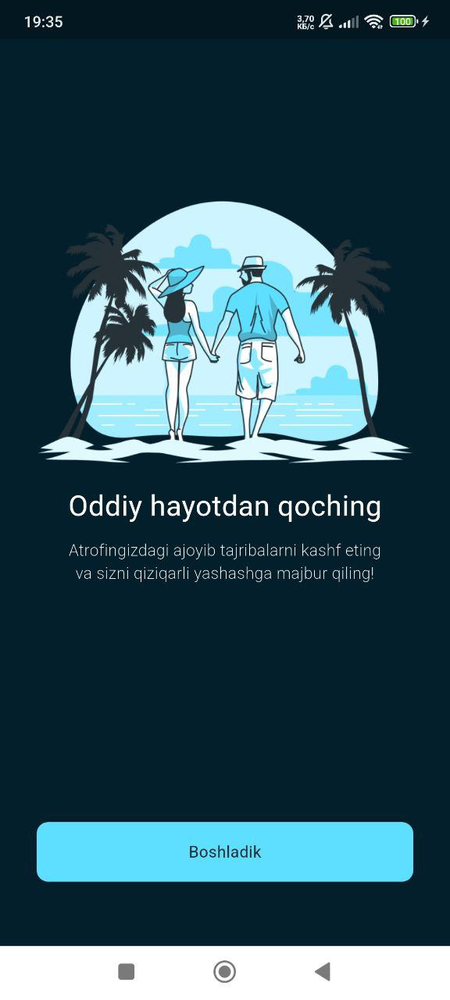

# Places for Travel - Flutter App

Welcome to the **Places for Travel** repository! This Flutter app is designed to help users explore and discover exciting travel destinations around the world. With a sleek UI and smooth user experience, you can easily browse through different places, save your favorite destinations, and more. Whether you're planning a trip or simply exploring ideas, this app is your travel companion!

---

### 🌍 **App Overview**

**Places for Travel** is an app designed for travel enthusiasts. It allows users to:
- Discover popular places and destinations.
- Browse through detailed information about various locations.
- Save and organize favorite places for future travel planning.
- Explore travel inspiration for the next adventure.

Built with **Flutter**, this app ensures a smooth, responsive experience on both **iOS** and **Android** platforms.

---

### 🚀 **Features**

- **Explore Destinations**: Browse a list of popular travel destinations from different parts of the world.
- **Save Favorites**: Save places you're interested in and organize them in a personal favorites list.
- **Search**: Find specific destinations using a powerful search feature.
- **Detailed Information**: View detailed information about each place, including images, descriptions, and highlights.
- **User-friendly UI**: Enjoy a beautiful, intuitive, and responsive user interface built with Flutter.
- **Offline Mode**: Access saved favorites and previously viewed places even when you're offline.

---

### ⚙️ **Technologies Used**

This app leverages the power of **Flutter** to create a fast and responsive user experience. The following technologies and libraries are used:

- **Flutter**: A cross-platform framework for building beautiful natively compiled applications for mobile, web, and desktop from a single codebase.
- **Provider**: State management to manage data across different screens and components of the app.
- **SharedPreferences**: Local database or storage to save user favorites and preferences.
- **Flutter Bloc (Optional)**: For state management if needed, especially for complex or dynamic UIs.

<table>
  <tr>
    <td></td>
    <td></td>
  </tr>
  <tr>
    <td></td>
    <td></td>
  </tr>
</table>
